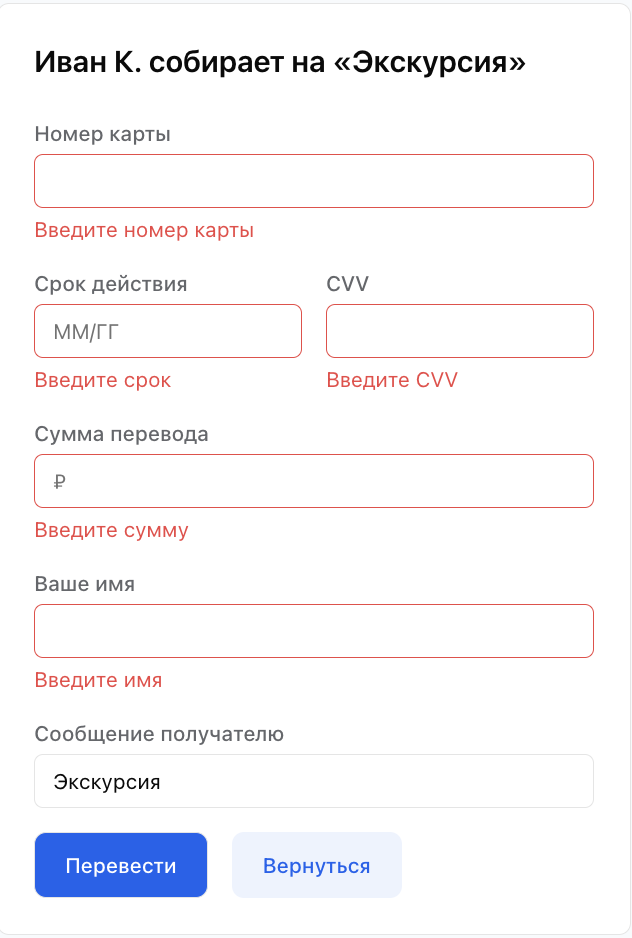

# Payment add Form (React)




## Пример запроса:

```json
{
  "hash_sum": "14d85e69dc948e2f04e7494e4f5cdbc89ec2a19d30900c180516098ad365bedb",
  "transaction": "43429034902490",
  "description": "описание_платежа",
  "api_key": " fcee9d8e-cf54-4e88-8911-517b6708367b",
  "amount": 100,
  "email": "email",
  "custom_data": {
    ...
  }
}
```
